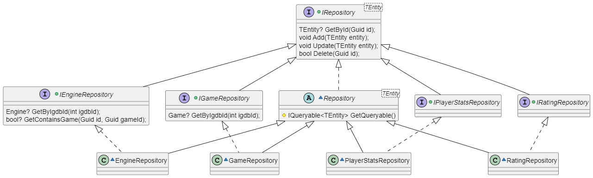
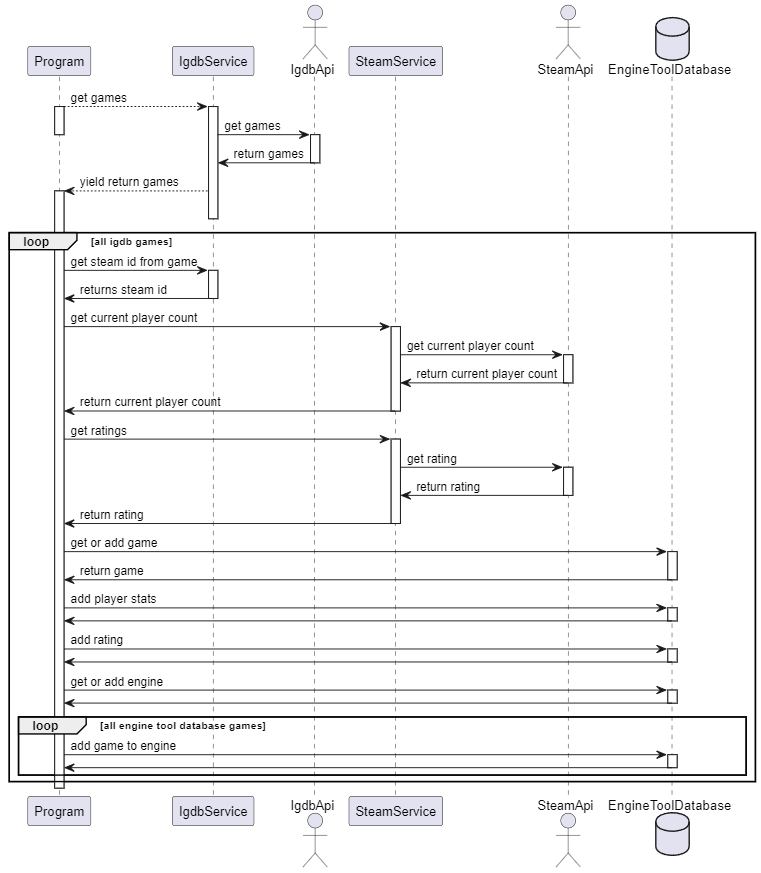

= Engine Tool

V0.0.1, 2024-05-27
:toc:
:toc-title: Inhaltsverzeichnis
:toclevels: 1

== Einführung
Das Engine Tool fügt Daten des Igdb API und des Steam API zusammen.
Das Ziel ist es anhand von Informationen wie Bewertungen und Spieler Zahlen verschiedener games eine Auswertung von Engines machen zu können.
Welche Engines stehen hinter games, welche viel gespielt werden, resp von games, welche eine gute Bewertung bekommen haben.

== Klassendiagramm

== Sequenz Diagramm
